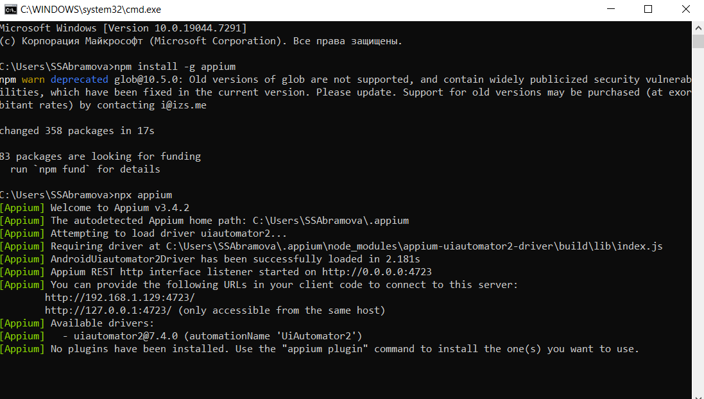
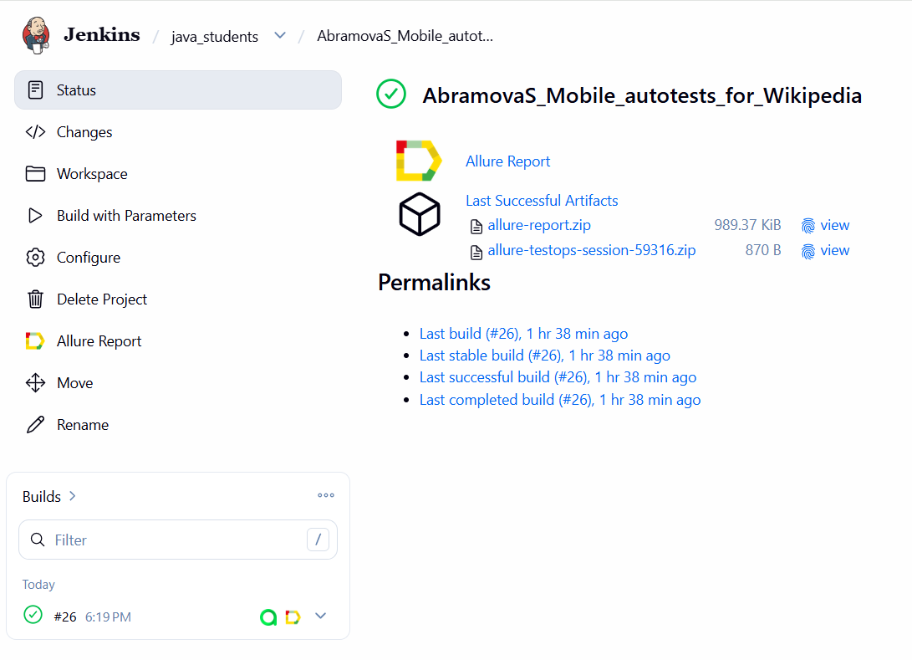
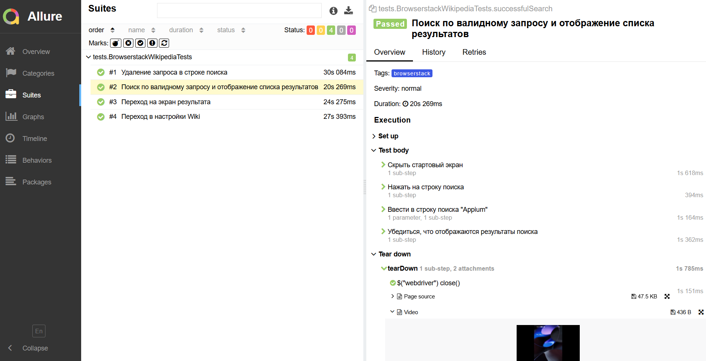
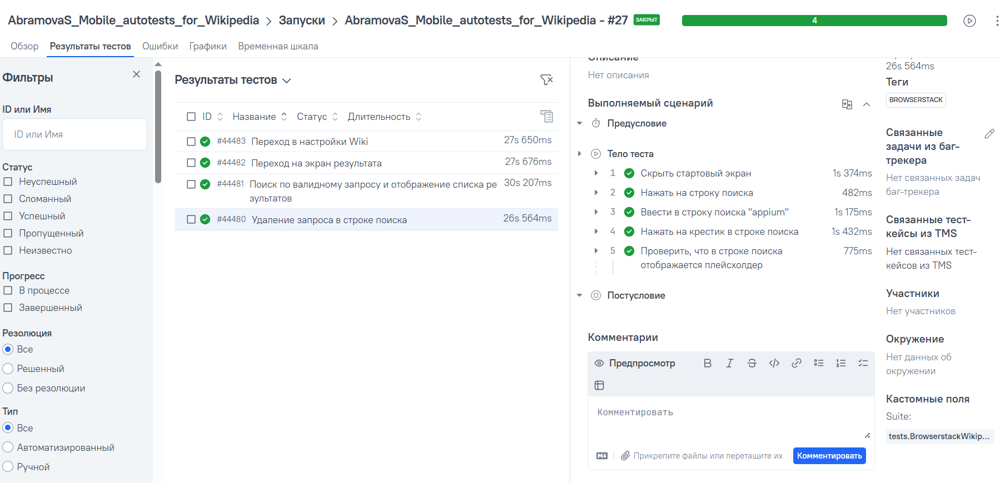
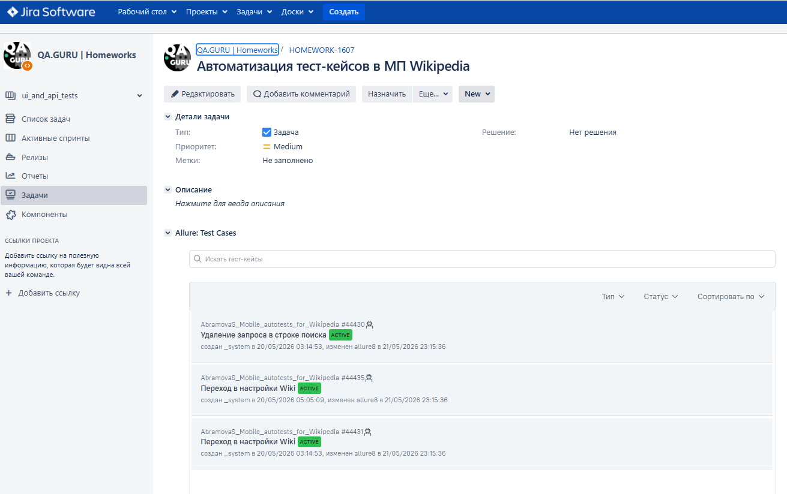
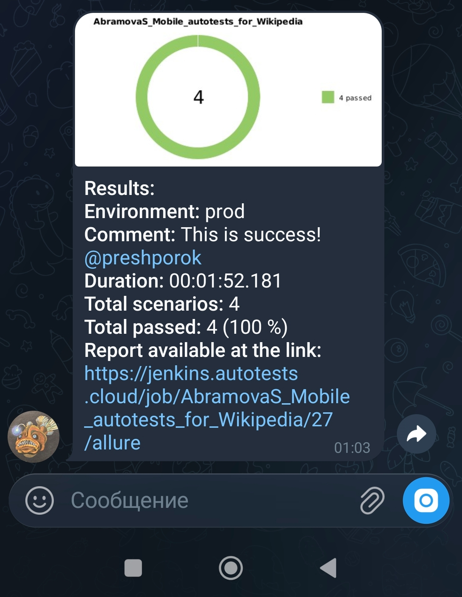
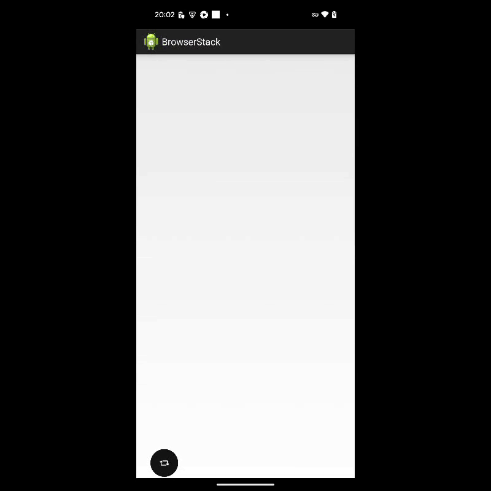

# Автотесты для мобильного приложения [Wikipedia](https://ru.wikipedia.org/wiki/%D0%97%D0%B0%D0%B3%D0%BB%D0%B0%D0%B2%D0%BD%D0%B0%D1%8F_%D1%81%D1%82%D1%80%D0%B0%D0%BD%D0%B8%D1%86%D0%B0)


Содержание
---
- [Инструменты и технологии](#инструменты-и-технологии)
- [Тестовые сценарии](#тестовые-сценарии)
- [Запуск автотестов](#запуск-автотестов)
- [Сборка в Jenkins](#сборка-в-jenkins)
- [Пример Allure-отчета](#пример-allure-отчета)
- [Интеграция с Allure TestOps](#интеграция-с-Allure-TestOps)
- [Интеграция с  Jira](#интеграция-с-Jira)
- [Уведомление в Telegram](#уведомление-в-telegram)
- [Пример видео из  Browserstack](#пример-видео-из-Browserstack)
---
## <a id="инструменты-и-технологии">Инструменты и технологии</a>

<p align="center">
   <a href="https://www.java.com" target="_blank" rel="noopener"></a>
   <a href="https://gradle.org" target="_blank" rel="noopener"></a>
   <a href="https://selenide.org" target="_blank" rel="noopener"></a>
   <a href="https://junit.org/junit5/" target="_blank" rel="noopener"></a>
   <a href="https://appium.io/docs/en/latest/" target="_blank" rel="noopener"></a>
   <a href="https://www.jenkins.io" target="_blank" rel="noopener"></a>
   <a href="https://aerokube.com/selenoid/" target="_blank" rel="noopener"></a><a href="https://allure.qatools.ru" target="_blank" rel="noopener"></a>
   <a href="https://www.browserstack.com/" target="_blank" rel="noopener"></a>
   <a href="https://allure.qatools.ru/testops" target="_blank" rel="noopener"></a>
   <a href="https://www.atlassian.com/software/jira" target="_blank" rel="noopener"></a>
   <a href="https://telegram.org" target="_blank" rel="noopener"></a>

## <a id="тестовые-сценарии">Тестовые сценарии</a>

* ✅ Поиск по валидному запросу и отображение списка результатов
* ✅ Переход на экран результата
* ✅ Удаление запроса в строке поиска
* ✅ Переход в настройки Wiki

---
* Тесты написаны на языке `Java` с применением фреймворка [Selenide](https://ru.selenide.org/) и паттерна Page Object
* Сборщик - `Gradle`
* `JUnit 5` задействован в качестве фреймворка модульного тестирования
* При прогоне тестов используются [Android Studio](https://developer.android.com/studio?hl=ru), [Browserstack](https://www.browserstack.com/), [Appium](https://appium.io/docs/en/latest/)
* В отчетах Allure для каждого теста (запускаемого удаленно) прикреплено видео прохождения теста

---
## <a id="запуск-автотестов">Запуск автотестов</a>
**Локальный запуск через эмулятор**

> Для запуска локальных тестов необходимо 
> установить Android Studio ([скачать](https://developer.android.com/studio)) и запустить Appium Server ([официальный сайт](https://appium.io)).



Затем выполнить команду:
```
gradle clean local_test -Dtag=local
```

**Удалённый запуск через Browserstack**
```
gradle clean browserstack_test -Dtag=browserstack
```

## <a id="сборка-в-jenkins">Сборка в Jenkins</a>
Jenkins автоматизирует запуск автотестов при изменении кода или по расписанию. 
Для выбора параметров (например, окружения, браузера, версии браузера и т.д.) и запуска сборки в Jenkins необходимо нажать <kbd>Build with Parameters</kbd>.
После прогона формируется отчет: результаты тестов, включая скриншоты, логи и видео, сохраняются в формате Allure и доступны по ссылке.


## <a id="пример-allure-отчета">Пример Allure-отчета</a>
Увидеть результаты автотестов можно в интерактивном Allure-отчёте — с детальными скриншотами, логами, видео и историей запусков. 
Ссылка на отчёт доступна после успешного запуска сборки в Jenkins.
### Тест-кейсы

## <a id="интеграция-с-Allure-TestOps">Интеграция с Allure TestOps</a>
Интеграция с Jenkins позволяет автоматически передавать результаты тестов из 
сборки в TestOps, где можно отслеживать историю запусков, анализировать прогоны, управлять тест-кейсами, дефектами и требованиями в одном месте. Через общие дашборды
можно делиться отчётами с командой и заказчиками.<br>
Jenkins-сборки можно запускать напрямую из Allure TestOps, выбрав нужную джобу и указав параметры.

### Тест-кейсы

## <a id="интеграция-с-Jira">Интеграция с  Jira</a>
В проекте настроена автоматическая отправка данных о сборке из Jenkins в систему управления задачами и проектами - Jira. В результате в задачах Jira появляются:
- Ссылка на сборку в Jenkins с деталями (номер, статус, логи)
- Список изменений (коммиты, авторы)
- Статус тестов (прошли/упали — на основе Allure-отчёта)
- Привязка к задачам — каждая сборка автоматически связывается с соответствующими задачами (Epics, Stories, Bugs)


## <a id="уведомление-в-telegram">Уведомление в Telegram</a>
Результат прогона отправляется в чат мессенджера Telegram


## <a id="пример-видео-из-Browserstack">Пример видео из  Browserstack</a>



